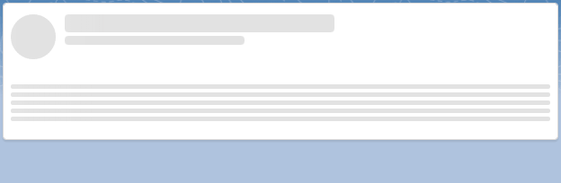
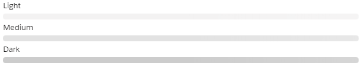
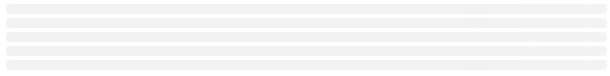

# Lightning Stencil

Lightning Stencil to provide a skeleton of your lightning web components while they are loading. Stencils help
provide a sense of faster loading times by giving your users an immediate sense of the layout that will be loaded.

Built following the [Salesforce Lightning Design System Loading specification for stencils.](https://www.lightningdesignsystem.com/guidelines/loading/)



## Basic Usage

Deploy the `stencil` web component and reference it in the component you want to use it.

```html
<c-stencil></c-stencil>
```

## Height

To specify a height use the `height` property and pass in a value in pixes.

```html
<c-stencil height="200"></c-stencil>
```


## Width

To specify a width use the `width` property and pass in a value in pixes.

```html
<c-stencil width="200"></c-stencil>
```


## Color variants

Stencils come in 3 different variants, `light`, `medium`, and `dark`.
Use the `weight-variant` property to specify the desired color variant.

```html
<c-stencil weight-variant="light"></c-stencil>
<c-stencil weight-variant="medium"></c-stencil>
<c-stencil weight-variant="dark"></c-stencil>
```



## Circles

To create stencils in the shape of a circle, which can be used when creating a user card with a profile picture, for instance
use the `circle` property:

```html
<c-stencil circle="true" height="50" width="50"></c-stencil>
```


## Multi-Line Stencils

To simulate a paragraph block use the `count` property to output multiple stencil lines
with a single component:

```html
<c-stencil height="10" count="5"></c-stencil>
```



## Example - User profile card

By taking advantage of [LWC's conditional rendering](https://developer.salesforce.com/docs/component-library/documentation/lwc/create_conditional) capabilities we can build entire stencil
components that are displayed to the user until your component's contents load and are ready 
to be displayed to the user.

Let's take a user profile component called that has the following markup in the `userProfile.html` template:

```html
  <article class="slds-card slds-p-around_x-small">
    <div class="slds-grid slds-gutters">
      <div class="slds-col slds-size_1-of-12 slds-m-right_x-small">
        <lightning-icon icon-name="action:user"></lightning-icon>
      </div>
      <div class="slds-col slds-size_11-of-12">
        <h2>John Smith</h2>
        <h3>CEO</h3>
      </div>
    </div>
    <lightning-card >
      <p>
        Lorem ipsum dolor sit amet, consectetur adipiscing elit, sed do eiusmod 
        tempor incididunt ut labore et dolore magna aliqua. Ut enim ad minim veniam, 
        quis nostrud exercitation ullamco laboris nisi ut aliquip ex ea commodo consequat. 
        Duis aute irure dolor in reprehenderit in voluptate velit esse cillum dolore eu fugiat 
        nulla pariatur. Excepteur sint occaecat cupidatat non proident, sunt in culpa qui officia 
        deserunt mollit anim id est laborum.
      </p>
    </lightning-card>
  </article>
```

To build a stencil (skeleton) for our component we can:

*  Build an alternative HTML template that uses the exact same layout as the
main component, but we substitute the places where we display data for `stencil` references.

Let's call it `userProfileStencil.html` and place it in the same directory as the main component.

```html
  <article class="slds-card slds-p-around_x-small">
    <div class="slds-grid slds-gutters">
      <div class="slds-col slds-size_1-of-12 slds-m-right_x-small">
        <c-stencil circle="true" height="50" width="50"></c-stencil>
      </div>
      <div class="slds-col slds-size_11-of-12">
        <c-stencil height="20" width="300"></c-stencil>
        <c-stencil width="200"></c-stencil>
      </div>
    </div>
    <lightning-card >
      <c-stencil height="5" count="5"></c-stencil>
    </lightning-card>
  </article>
```

* Reference the stencil template while your component loads

Import both templates and use the `render` method to decide when the stencil
should load or when your component is ready to render.

```javascript
import { LightningElement, track } from 'lwc';
import userProfileStencil from './userProfileStencil.html';
import userProfile from './userProfile.html';

export default class StencilContainer extends LightningElement {
  @track isLoading = true;

  render() {
    return this.isLoading ? userProfileStencil : userProfile;
  }

  renderedCallback() {
    // Simulating a long loading time until the component is ready to render.
    setTimeout(() => {this.isLoading = false;}, 5000);
  }
```
